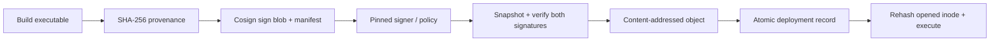

# Artifact Trust Gate

[](https://github.com/JDinSeattle/artifact-trust-gate/actions/workflows/ci.yml)

An offline release gate for the CPU GEMM executable. It uses real **Cosign 2.6.5** signatures and separates valid signature mathematics from signer authorization and provenance policy. The gate snapshots inputs once, verifies both executable and provenance, promotes content-addressed bytes, and records the exact deployment digest.

The allow/reject matrix contains 17 cases, including valid release, idempotence, byte tampering, stale-signature tag retargeting (local path analogue), a mathematically valid unauthorized signer, wrong signature, unknown algorithm/format, wrong builder/predicate, verifier crash/timeout, symlink input, and post-promotion tampering. The consumer rehashes and executes the same opened inode via `/proc/self/fd`.

Private test keys are generated in a temporary directory and removed; only public keys, signatures, test-owned executables and verification evidence are archived. This is local-key authorization, not keyless CI identity, admission control, vulnerability scanning, compliance certification or a SLSA level claim.

## September 2026 maintenance

The verifier moves from Cosign 2.6.1 to the maintained 2.6.5 patch. The campaign additionally verifies the checked-in historical executable and provenance signatures with the new binary. JSON parsing rejects nonfinite constants; policy identity fields require bounded strings. Consumption validates the deployment record, rejects symlinked object directories and opens the executable with O_NOFOLLOW and O_NONBLOCK before checking regular-file type and size. A FIFO regression proves rejection without blocking.

[Design, acceptance tests and limits](docs/refresh-20260907.md) · [Current measured results](docs/refresh-results-20260907.md). CI repeats validation on Python 3.12 and 3.14.7.

## Reproduce

```bash
git clone https://github.com/JDinSeattle/artifact-trust-gate.git
cd artifact-trust-gate
make verify
python3 evidence.py .runs/latest
```

`make test` runs focused contract regressions. `make verify` also builds and executes real integration/fault experiments. A prior `.runs/latest` is moved to a timestamped archive before a fresh run; nonempty output directories outside `.runs` are never overwritten. GitHub Actions executes the same entry point and uploads evidence even on failure.

The checked-in [local evidence](evidence/local/) has raw records, a source/environment manifest and SHA-256 artifact hashes. Verify it with `make evidence-check`. [Measured results](docs/results.md), [engineering notes](docs/engineering.md), and [interview guide](docs/interview.md) explain what can be claimed.

## System



The signed provenance binds the artifact digest, declared source digest, builder and predicate. The trusted policy pins the public-key bytes and permitted builder/predicate/format/hash algorithm. A builder claim is a statement by the authorized local signer, not independently authenticated CI metadata. Policy and tool administration are outside the artifact submitter's authority.

## Support and evidence limits

Linux x86_64, Python ≥3.10, g++, and checksum-pinned Cosign downloaded on first run (~149 MiB). Only our own local blobs and ephemeral local keys are used. Offline verification deliberately excludes the transparency log (`--offline --insecure-ignore-tlog`) for this test-key model. The gate assumes trusted policy/tool/deployment directories and a trusted authorized builder. Same-UID concurrent host writers, compromised builder, malicious toolchain and root are outside the boundary. Atomic file replacement is tested, but no power-loss durability claim. No freshness/rollback policy, registry API, SBOM vulnerability verdict, KMS or algorithm migration qualification; upgrading Cosign requires rerunning the matrix before changing the pin.


**Role evidence:** Platform security · software supply chain. This is an author-operated engineering lab. AI-assisted implementation is disclosed; ownership means understanding, reproducing and explaining the code and measurements. No external customer, production operation, upstream contribution or independent reviewer is implied.

MIT licensed. Operator source vendoring, where present, is recorded in `vendor/lock.json`; upstream workload attribution, where present, is in `upstream/`.
