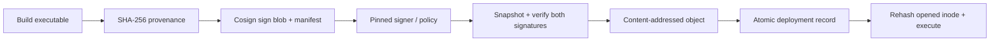

# Engineering contract

The signed provenance binds the artifact digest, declared source digest, builder and predicate. The trusted policy pins the public-key bytes and permitted builder/predicate/format/hash algorithm. A builder claim is a statement by the authorized local signer, not independently authenticated CI metadata. Policy and tool administration are outside the artifact submitter's authority.

## Compatibility and limits

Linux x86_64, Python ≥3.10, g++, and checksum-pinned Cosign downloaded on first run (~149 MiB). Only our own local blobs and ephemeral local keys are used. Offline verification deliberately excludes the transparency log (`--offline --insecure-ignore-tlog`) for this test-key model. The gate assumes trusted policy/tool/deployment directories and a trusted authorized builder. Same-UID concurrent host writers, compromised builder, malicious toolchain and root are outside the boundary. Atomic file replacement is tested, but no power-loss durability claim. No freshness/rollback policy, registry API, SBOM vulnerability verdict, KMS or algorithm migration qualification; upgrading Cosign requires rerunning the matrix before changing the pin.

## Threat model and fail-closed behavior

Untrusted: submitted blob, provenance, signatures, supplied public key and mutable source path/tag analogue. Trusted: policy administration, pinned Cosign binary, local authorized signing process and deployment directory. A foreign signer may create a mathematically valid signature; the `foreign-math-valid.json` record proves that validity before the policy rejects its public-key fingerprint.

Provenance and artifact must both verify. Digest agreement alone cannot authenticate provenance, and signature success alone cannot authorize a signer. Unsupported policy versions, signature format/algorithm, malformed/duplicate JSON, symlink inputs, oversized/nonregular files, wrong predicate/builder and verifier timeout/failure cannot create a deployment record. Input snapshots bind the verification and copy steps. The consumer hashes an opened inode and executes it through `/proc/self/fd`, reducing path replacement races. Trusted same-UID mutation of that inode is explicitly outside the boundary.

Only synthetic local-key policy is supported. Public key trust comes from the policy author's reviewed SHA-256 fingerprint; the policy is not learned from the submitted artifact. SBOMs are not generated or interpreted as vulnerability evidence. Keyless would require separate issuer/subject and bundle-trust tests. Changing verifier versions or algorithms requires a new compatibility campaign before updating the checksum pin.

Reference: [Cosign verification](https://docs.sigstore.dev/cosign/verifying/verify/). Offline flags are intentional for locally generated keys without a transparency-log entry.
